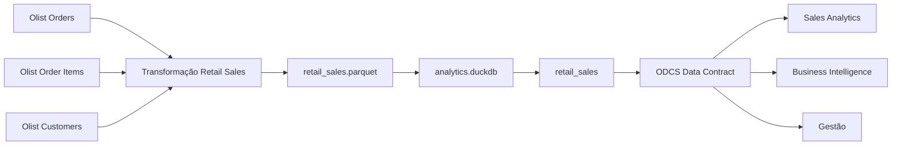

# Data Product de Vendas de Varejo - Olist

Projeto desenvolvido para a disciplina **Data Product Management & Value Delivery**.

A solução implementa um Data Product governado de vendas de varejo utilizando o **Brazilian E-Commerce Public Dataset by Olist** como fonte de dados.

O projeto segue a **Trilha 1 - Gestão e Governança**, com foco em:

- definição de um Data Product orientado a negócio;
- Data Product Canvas;
- contrato formal no padrão ODCS;
- validação automatizada de schema e regras de negócio;
- simulação de breaking changes;
- Data Downtime;
- impacto financeiro;
- Error Budget;
- catálogo;
- SLI, SLO e SLA;
- governança;
- linhagem de dados.

---

# 1. Cobertura dos Requisitos da Avaliação

O projeto foi estruturado para atender ao requisito obrigatório e aos três bônus da Trilha 1.

| Requisito | Implementação | Evidência |
|---|---|---|
| Mandatório - Data Product Canvas | Definição do problema, proposta de valor, consumidores, grão, inputs, outputs e garantias | [`docs/canvas_produto_dados.md`](docs/canvas_produto_dados.md) |
| Mandatório - Data Contract ODCS | Schema formal de saída e regras de negócio | [`datacontract.yaml`](datacontract.yaml) |
| Bônus 1 - Validação Automatizada | Validação do Data Contract contra uma base DuckDB | [`evidencias/05_contrato_valido.txt`](evidencias/05_contrato_valido.txt) |
| Bônus 2 - Economia de Data Downtime | Simulação de incidente, impacto financeiro e Error Budget | [`docs/simulacao_incidente.md`](docs/simulacao_incidente.md) |
| Bônus 3 - Catálogo & Governança | Catálogo, linhagem, SLI, SLO, SLA e governança | [`docs/catalogo.md`](docs/catalogo.md) |

Também foi criado um contrato propositalmente incompatível para demonstrar a identificação de breaking changes:

[`datacontract_quebra.yaml`](datacontract_quebra.yaml)

---

# 2. Problema de Negócio

Os dados necessários para análise de vendas estão originalmente distribuídos em diferentes fontes operacionais.

No dataset Olist, por exemplo, informações sobre:

- pedidos;
- produtos vendidos;
- clientes;
- preços;
- status dos pedidos;

estão armazenadas em tabelas diferentes.

Sem um Data Product governado, cada consumidor analítico poderia realizar sua própria integração entre essas fontes e recriar regras de negócio individualmente.

Isso pode causar:

- duplicação de transformações;
- métricas inconsistentes;
- interpretações diferentes sobre vendas;
- divergências entre relatórios;
- dificuldade de rastreabilidade;
- maior impacto de alterações upstream;
- aumento do esforço dos consumidores analíticos.

O objetivo deste projeto é transformar essas fontes operacionais em uma **interface analítica padronizada, documentada, governada e contratualizada**.

---

# 3. Definição do Data Product

## Nome de Negócio

**Data Product de Vendas de Varejo**

## Nome Técnico

```text
retail_sales
```

## Domínio

```text
Varejo / Vendas
```

## Versão

```text
1.0.0
```

## Owner

```text
Time de Sales Analytics
```

## Proposta de Valor

O `retail_sales` disponibiliza uma visão analítica consistente das vendas.

O produto permite identificar:

- quando a venda ocorreu;
- qual pedido originou a venda;
- qual cliente realizou a compra;
- qual produto foi vendido;
- quantas unidades foram vendidas;
- qual foi o valor da venda;
- qual é o status operacional do pedido.

---

# 4. Grão do Data Product

O grão definido é:

> **Um Produto dentro de um Pedido.**

Isso significa que cada linha representa uma combinação única entre:

```text
order_id + product_id
```

Caso o mesmo produto apareça várias vezes dentro do mesmo pedido, os registros são agregados.

## Exemplo

Dados operacionais:

```text
Pedido 123 | Produto A | R$ 100
Pedido 123 | Produto A | R$ 100
Pedido 123 | Produto A | R$ 100
```

Saída do Data Product:

```text
Pedido 123
Produto A
Quantidade: 3
Valor de Vendas: R$ 300
```

A definição explícita do grão evita ambiguidades sobre o significado de cada registro.

---

# 5. Schema de Saída

O Data Product possui oito atributos.

| Campo | Tipo | Significado |
|---|---|---|
| `sales_line_id` | String | Identificador técnico único da combinação Pedido + Produto |
| `sale_date` | Date | Data em que o pedido foi realizado |
| `order_id` | String | Identificador do pedido |
| `customer_id` | String | Identificador único e anonimizado do cliente |
| `product_id` | String | Identificador do produto vendido |
| `quantity` | Integer | Quantidade daquele produto dentro do pedido |
| `sales_amount` | Decimal | Soma dos preços dos itens, sem incluir frete |
| `order_status` | String | Status operacional do pedido |

---

# 6. Justificativa dos Atributos

O schema foi deliberadamente mantido enxuto.

Cada atributo existe porque responde diretamente a uma necessidade do consumidor do produto.

## `sales_line_id`

Responde:

> Qual é esta linha de venda?

É uma chave técnica construída pela combinação:

```text
order_id + product_id
```

Sua finalidade é garantir unicidade e rastreabilidade.

---

## `sale_date`

Responde:

> Quando a venda ocorreu?

É derivado do campo original:

```text
order_purchase_timestamp
```

O timestamp é convertido para `DATE`, pois o produto foi desenhado para análise diária de vendas.

---

## `order_id`

Responde:

> Qual pedido originou esta venda?

Permite rastrear a linha analítica até sua transação operacional de origem.

---

## `customer_id`

Responde:

> Quem realizou a compra?

É derivado do:

```text
customer_unique_id
```

do Olist.

Esse identificador permite reconhecer o mesmo cliente em pedidos diferentes sem expor informações pessoais identificáveis.

---

## `product_id`

Responde:

> Qual produto foi vendido?

Também permite integração downstream com outros produtos ou dimensões de produto.

---

## `quantity`

Responde:

> Quantas unidades foram vendidas?

É calculado pela quantidade de ocorrências do mesmo produto dentro do mesmo pedido:

```text
COUNT(*)
```

---

## `sales_amount`

Responde:

> Qual foi o valor vendido?

É calculado como:

```text
SUM(item_price)
```

para a combinação Pedido + Produto.

O frete não é incluído.

Por isso:

```text
sales_amount
```

representa o valor dos itens vendidos e não necessariamente o valor total pago pelo cliente.

---

## `order_status`

Responde:

> Qual é a situação operacional do pedido?

Permite distinguir pedidos:

- entregues;
- cancelados;
- aprovados;
- enviados;
- em processamento;
- entre outros.

---

# 7. Arquitetura da Solução



A solução possui as seguintes etapas:

```text
Fontes Operacionais
        ↓
Transformação
        ↓
Parquet
        ↓
DuckDB
        ↓
Data Contract
        ↓
Consumidores Analíticos
```

---

# 8. Fontes de Dados

O projeto utiliza o:

> **Brazilian E-Commerce Public Dataset by Olist**

disponibilizado publicamente no Kaggle.

Embora o dataset possua diversas tabelas, apenas três são necessárias para este Data Product.

## Olist Orders

```text
olist_orders_dataset.csv
```

Fornece:

- `order_id`;
- `customer_id`;
- `order_purchase_timestamp`;
- `order_status`.

---

## Olist Order Items

```text
olist_order_items_dataset.csv
```

Fornece:

- `order_id`;
- `product_id`;
- `price`.

---

## Olist Customers

```text
olist_customers_dataset.csv
```

Fornece:

- `customer_id`;
- `customer_unique_id`.

---

# 9. Estrutura do Projeto

```text
fiap-data-product-vendas-varejo/
│
├── data/
│   ├── raw/
│   │   ├── olist_orders_dataset.csv
│   │   ├── olist_order_items_dataset.csv
│   │   └── olist_customers_dataset.csv
│   │
│   ├── retail_sales.parquet
│   └── analytics.duckdb
│
├── src/
│   ├── 01_preparar_olist.py
│   ├── 02_configurar_duckdb.py
│   └── 03_consultar_dados.py
│
├── docs/
│   ├── canvas_produto_dados.md
│   ├── catalogo.md
│   └── simulacao_incidente.md
│
├── evidencias/
│   ├── 01_construcao_retail_sales.txt
│   ├── 02_configuracao_duckdb.txt
│   ├── 03_consulta_analitica.txt
│   ├── 04_validacao_sintaxe_contrato.txt
│   ├── 05_contrato_valido.txt
│   └── 06_quebra_esperada.txt
│
├── datacontract.yaml
├── datacontract_quebra.yaml
├── requirements.txt
├── .gitignore
└── README.md
```

> A pasta `data/` é ignorada pelo Git porque contém os dados brutos e arquivos analíticos gerados durante a execução.

---

# 10. Ambiente de Desenvolvimento

O projeto foi desenvolvido utilizando:

> **GitHub Codespaces**

O uso de Codespaces permite executar todo o projeto em um ambiente Python reproduzível diretamente pelo navegador.

Também é possível executar localmente em um ambiente Python compatível.

---

# 11. Instalação das Dependências

Na raiz do repositório, execute:

```bash
pip install -r requirements.txt
```

O arquivo `requirements.txt` contém:

```text
duckdb>=1.1.0
datacontract-cli[duckdb]>=0.10.0
pandas>=2.2.0
pyarrow>=17.0.0
kaggle
```

As principais tecnologias utilizadas são:

- **DuckDB:** engine analítica e banco de dados local;
- **Data Contract CLI:** validação automatizada do contrato;
- **Pandas:** manipulação e visualização auxiliar;
- **PyArrow:** suporte ao formato Parquet;
- **Kaggle CLI:** obtenção do dataset.

---

# 12. Validação do Ambiente

Após a instalação, é possível confirmar o ambiente com:

```bash
python --version
```

```bash
datacontract --version
```

```bash
python -c "import duckdb; print(duckdb.__version__)"
```

Os três comandos devem ser executados sem erros.

---

# 13. Download dos Dados Olist

Crie a pasta de dados, caso ainda não exista:

```bash
mkdir -p data/raw
```

O dataset pode ser baixado utilizando a Kaggle CLI:

```bash
kaggle datasets download olistbr/brazilian-ecommerce -p data/raw --unzip
```

Caso seja solicitada autenticação, autentique sua conta Kaggle e execute o comando novamente.

Depois do download:

```bash
ls data/raw
```

Os três arquivos necessários devem estar disponíveis:

```text
olist_orders_dataset.csv
olist_order_items_dataset.csv
olist_customers_dataset.csv
```

Os demais arquivos do dataset podem permanecer na pasta, mas não são utilizados neste produto.

---

# 14. Etapa 1 - Construção do Data Product

Execute:

```bash
python src/01_preparar_olist.py
```

O script realiza a transformação principal do projeto.

Ele:

1. verifica se os três arquivos de origem existem;
2. lê `Olist Orders`;
3. lê `Olist Order Items`;
4. lê `Olist Customers`;
5. relaciona os dados de pedidos e itens por `order_id`;
6. relaciona os pedidos aos clientes;
7. converte o timestamp da compra em `sale_date`;
8. utiliza `customer_unique_id` como identificador analítico do cliente;
9. agrupa os dados no grão Pedido + Produto;
10. calcula `quantity`;
11. calcula `sales_amount`;
12. gera `sales_line_id`;
13. cria o arquivo Parquet final.

---

## 14.1 Lógica de Agregação

O agrupamento é realizado conceitualmente por:

```text
sale_date
order_id
customer_id
product_id
order_status
```

A quantidade é calculada como:

```text
quantity = COUNT(*)
```

O valor de vendas é calculado como:

```text
sales_amount = SUM(item_price)
```

---

## 14.2 Resultado Esperado

O arquivo criado é:

```text
data/retail_sales.parquet
```

A execução deve terminar com mensagem equivalente a:

```text
[OK] Arquivo criado: data/retail_sales.parquet

DATA PRODUCT DE VENDAS CRIADO COM SUCESSO
```

---

## 14.3 Evidência da Construção

A saída pode ser registrada utilizando:

```bash
python src/01_preparar_olist.py 2>&1 | tee evidencias/01_construcao_retail_sales.txt
```

Evidência:

[`evidencias/01_construcao_retail_sales.txt`](evidencias/01_construcao_retail_sales.txt)

---

# 15. Etapa 2 - Configuração do DuckDB

Após a criação do Parquet:

```bash
python src/02_configurar_duckdb.py
```

O script carrega:

```text
data/retail_sales.parquet
```

em:

```text
data/analytics.duckdb
```

criando a tabela:

```text
retail_sales
```

O fluxo é:

```text
retail_sales.parquet
        ↓
analytics.duckdb
        ↓
retail_sales
```

---

## 15.1 Evidência da Configuração

Execute:

```bash
python src/02_configurar_duckdb.py 2>&1 | tee evidencias/02_configuracao_duckdb.txt
```

Evidência:

[`evidencias/02_configuracao_duckdb.txt`](evidencias/02_configuracao_duckdb.txt)

---

# 16. Etapa 3 - Consulta do Data Product

Execute:

```bash
python src/03_consultar_dados.py
```

O script demonstra o consumo analítico do produto.

Ele apresenta:

- inspeção de schema;
- tipos dos campos;
- quantidade de linhas;
- quantidade de pedidos;
- quantidade de clientes;
- quantidade de produtos;
- volume vendido;
- valor total de vendas;
- vendas por status;
- produtos com maior valor de vendas;
- amostra do Data Product.

---

## 16.1 Schema Esperado

O `DESCRIBE retail_sales` deve apresentar:

```text
sales_line_id
sale_date
order_id
customer_id
product_id
quantity
sales_amount
order_status
```

---

## 16.2 Evidência da Consulta

Execute:

```bash
python src/03_consultar_dados.py 2>&1 | tee evidencias/03_consulta_analitica.txt
```

Evidência:

[`evidencias/03_consulta_analitica.txt`](evidencias/03_consulta_analitica.txt)

---

# 17. Etapa 4 - Data Product Canvas

O Canvas formaliza o produto antes da perspectiva puramente técnica.

Ele documenta:

- problema de negócio;
- proposta de valor;
- consumidores;
- grão;
- Input Ports;
- Output Ports;
- métricas;
- garantias de qualidade;
- níveis de serviço;
- métricas de sucesso.

Documento:

[`docs/canvas_produto_dados.md`](docs/canvas_produto_dados.md)

---

# 18. Etapa 5 - Data Contract ODCS

O contrato formal do produto é:

[`datacontract.yaml`](datacontract.yaml)

Ele estabelece a interface entre o Data Product e seus consumidores.

O contrato define:

- identificação do produto;
- versão;
- owner;
- conexão com DuckDB;
- tabela esperada;
- campos;
- tipos;
- obrigatoriedade;
- unicidade;
- valores mínimos;
- domínio de valores;
- níveis de serviço.

---

# 19. Regras de Negócio do Contrato

## `sales_line_id`

Deve ser:

```text
obrigatório
+
único
```

---

## `sale_date`

Deve estar presente para todas as linhas.

---

## `order_id`

Deve ser obrigatório.

---

## `customer_id`

Deve ser obrigatório.

---

## `product_id`

Deve ser obrigatório.

---

## `quantity`

Deve obedecer:

```text
quantity >= 1
```

---

## `sales_amount`

Deve obedecer:

```text
sales_amount >= 0.01
```

---

## `order_status`

Deve pertencer ao domínio:

```text
approved
canceled
created
delivered
invoiced
processing
shipped
unavailable
```

---

# 20. Etapa 6 - Validação da Sintaxe do Contrato

Antes de validar os dados, a estrutura do contrato é verificada.

Execute:

```bash
datacontract lint datacontract.yaml
```

Isso verifica se o arquivo está estruturado corretamente.

---

## 20.1 Evidência

Para salvar a saída:

```bash
datacontract lint datacontract.yaml 2>&1 | tee evidencias/04_validacao_sintaxe_contrato.txt
```

Evidência:

[`evidencias/04_validacao_sintaxe_contrato.txt`](evidencias/04_validacao_sintaxe_contrato.txt)

---

# 21. Etapa 7 - Validação Automatizada do Data Contract

O contrato é então validado diretamente contra:

```text
data/analytics.duckdb
```

Execute:

```bash
datacontract test datacontract.yaml
```

O `datacontract-cli` verifica automaticamente:

- existência dos campos;
- tipos;
- campos obrigatórios;
- valores ausentes;
- unicidade;
- regras mínimas;
- domínio de `order_status`.

---

## 21.1 Resultado Esperado

A implementação válida deve retornar:

```text
data contract is valid
```

com:

```text
28 checks
```

executados com sucesso.

---

## 21.2 Evidência

Execute:

```bash
datacontract test datacontract.yaml 2>&1 | tee evidencias/05_contrato_valido.txt
```

Evidência:

[`evidencias/05_contrato_valido.txt`](evidencias/05_contrato_valido.txt)

Essa execução demonstra a validação automatizada do schema e das regras de negócio contra uma base real.

---

# 22. Etapa 8 - Simulação de Breaking Change

O projeto contém um segundo contrato:

[`datacontract_quebra.yaml`](datacontract_quebra.yaml)

Esse arquivo foi criado propositalmente com regras incompatíveis.

O objetivo é demonstrar que alterações que violam o contrato podem ser detectadas automaticamente.

---

## 22.1 Breaking Change - Valor de Vendas

A regra de `sales_amount` é alterada propositalmente para:

```text
sales_amount >= 10000
```

Existem registros reais abaixo desse valor.

Resultado esperado:

```text
FAIL
```

---

## 22.2 Breaking Change - Status

O domínio de `order_status` é alterado para aceitar somente:

```text
delivered
```

Porém existem outros status reais.

Resultado esperado:

```text
FAIL
```

---

## 22.3 Breaking Change - Nova Coluna Obrigatória

É criada a coluna obrigatória:

```text
sales_channel
```

Porém ela não existe no Data Product.

Resultado esperado:

```text
FAIL
```

---

# 23. Executar o Contrato de Quebra

Execute:

```bash
datacontract test datacontract_quebra.yaml
```

Diferentemente do contrato oficial, **a falha é esperada**.

Ela demonstra que o mecanismo de validação identifica:

- mudança incompatível de schema;
- regra semântica incompatível;
- domínio incompatível.

---

## 23.1 Evidência

Execute:

```bash
datacontract test datacontract_quebra.yaml 2>&1 | tee evidencias/06_quebra_esperada.txt
```

Evidência:

[`evidencias/06_quebra_esperada.txt`](evidencias/06_quebra_esperada.txt)

---

# 24. Resultado do Quality Gate

A lógica demonstrada é:

```text
Data Product válido
        +
Data Contract oficial
        ↓
PASS
```

Enquanto:

```text
Data Product válido
        +
Contrato incompatível
        ↓
FAIL
```

A segunda falha é proposital e demonstra o funcionamento do mecanismo preventivo.

---

# 25. Etapa 9 - Simulação de Data Downtime

Também foi criado um cenário simulado de incidente operacional.

Documento completo:

[`docs/simulacao_incidente.md`](docs/simulacao_incidente.md)

O cenário considera uma alteração upstream em:

```text
product_id
```

O campo é removido ou renomeado.

Como consequência:

```text
product_id indisponível
        ↓
Transformação falha
        ↓
retail_sales não é atualizado
        ↓
Publicação falha
        ↓
Consumidores recebem dados desatualizados
```

---

# 26. MTTD e MTTR

A linha do tempo simulada é:

```text
Publicação esperada: 08:00

Incidente detectado: 08:45

Serviço restaurado:  12:00
```

Portanto:

```text
MTTD = 45 minutos
```

e:

```text
MTTR = 3 horas e 15 minutos
```

O Data Downtime total é:

```text
45 minutos
+
3h15

= 4 horas
```

---

# 27. Impacto Financeiro Simulado

Foram definidas premissas exclusivamente acadêmicas.

Elas **não representam dados financeiros ou operacionais reais da Olist**.

Premissas:

```text
Consumidores impactados: 12

Custo médio:
R$ 150 por hora

Downtime:
4 horas
```

Cálculo:

```text
12 × R$ 150 × 4
```

Resultado:

```text
R$ 7.200
```

Portanto:

> **Impacto operacional estimado: R$ 7.200**

O cálculo representa somente uma estimativa simplificada de produtividade perdida.

---

# 28. Error Budget

O SLO mensal de disponibilidade é:

```text
99,5%
```

Portanto:

```text
Error Budget
=
100% - 99,5%
```

Resultado:

```text
0,5%
```

Para um mês com 30 dias:

```text
30 × 24
=
720 horas
```

Logo:

```text
720 × 0,5%
=
3,6 horas
```

O Error Budget mensal é:

> **3,6 horas**

---

## 28.1 Comparação com o Incidente

Data Downtime:

```text
4 horas
```

Error Budget:

```text
3,6 horas
```

Comparação:

```text
4 > 3,6
```

Resultado:

> **Error Budget excedido**

Excesso:

```text
4,0 - 3,6
=
0,4 hora
```

ou:

```text
24 minutos
```

---

# 29. Etapa 10 - Catálogo e Governança

A documentação completa do Data Product está disponível em:

[`docs/catalogo.md`](docs/catalogo.md)

O catálogo documenta:

1. propósito;
2. grão;
3. Input Ports;
4. Output Ports;
5. dicionário de dados;
6. definições de negócio;
7. garantias de qualidade;
8. consumidores;
9. SLIs;
10. SLOs;
11. SLA;
12. Error Budget;
13. governança;
14. linhagem;
15. interpretação da linhagem.

---

# 30. SLIs

Os principais Service Level Indicators definidos são:

### Freshness

Tempo entre a disponibilidade dos dados de origem e a publicação do Data Product.

### Availability

Percentual do tempo em que o produto permanece disponível e válido.

### Data Quality

Percentual de regras críticas aprovadas.

### Incident Communication

Tempo entre a detecção de um incidente crítico e a comunicação aos consumidores.

---

# 31. SLOs

| Indicador | Meta |
|---|---:|
| Freshness | ≤ 24 horas |
| Disponibilidade | ≥ 99,5% mensal |
| Qualidade crítica | 100% antes da publicação |
| Comunicação de incidente | ≤ 1 hora após detecção |
| Retenção | ≥ 365 dias |

---

# 32. SLA

O cenário simulado estabelece compromissos formais entre o time do produto e seus consumidores.

Entre eles:

- atualização dentro da janela acordada;
- disponibilidade mínima mensal;
- bloqueio de publicação quando regras críticas falharem;
- comunicação de incidentes;
- manutenção do histórico.

Em caso de violação:

1. o incidente deve ser registrado;
2. consumidores devem ser comunicados;
3. restauração passa a ser prioridade;
4. a causa raiz deve ser investigada;
5. o Error Budget deve ser atualizado;
6. ações preventivas devem ser registradas.

---

# 33. Governança

O owner simulado do produto é:

```text
Time de Sales Analytics
```

Responsabilidades:

- definições de negócio;
- manutenção do contrato;
- regras de qualidade;
- documentação;
- níveis de serviço;
- versionamento;
- comunicação com consumidores;
- tratamento de incidentes.

---

# 34. Versionamento

A versão atual é:

```text
1.0.0
```

Mudanças compatíveis podem gerar novas versões minor.

Exemplo:

```text
1.0.0 → 1.1.0
```

Breaking changes devem gerar nova versão major.

Exemplo:

```text
1.0.0 → 2.0.0
```

---

# 35. Linhagem


A linhagem torna explícita a dependência entre:

```text
Fontes
↓
Transformação
↓
Output
↓
Banco
↓
Contrato
↓
Consumidores
```

Isso facilita análise de impacto e investigação de incidentes.

---

# 36. Evidências da Solução

Todas as execuções relevantes são registradas em arquivos de texto.

| Evidência | Resultado Esperado | Arquivo |
|---|---|---|
| Construção do Data Product | PASS | [`01_construcao_retail_sales.txt`](evidencias/01_construcao_retail_sales.txt) |
| Configuração do DuckDB | PASS | [`02_configuracao_duckdb.txt`](evidencias/02_configuracao_duckdb.txt) |
| Consulta Analítica | PASS | [`03_consulta_analitica.txt`](evidencias/03_consulta_analitica.txt) |
| Validação de Sintaxe | PASS | [`04_validacao_sintaxe_contrato.txt`](evidencias/04_validacao_sintaxe_contrato.txt) |
| Data Contract Oficial | PASS - 28 checks | [`05_contrato_valido.txt`](evidencias/05_contrato_valido.txt) |
| Contrato de Breaking Change | FAIL esperado | [`06_quebra_esperada.txt`](evidencias/06_quebra_esperada.txt) |

A falha da última execução é proposital e representa uma evidência de que o mecanismo de proteção está funcionando corretamente.

---

# 37. Como Reproduzir o Projeto do Zero

Depois de criar ou clonar o repositório, execute os passos abaixo na raiz do projeto.

## Passo 1 - Instalar dependências

```bash
pip install -r requirements.txt
```

---

## Passo 2 - Criar a pasta de dados

```bash
mkdir -p data/raw
```

---

## Passo 3 - Baixar o Olist

```bash
kaggle datasets download olistbr/brazilian-ecommerce -p data/raw --unzip
```

Confirme:

```bash
ls data/raw
```

---

## Passo 4 - Construir o Data Product

```bash
python src/01_preparar_olist.py
```

---

## Passo 5 - Criar o DuckDB

```bash
python src/02_configurar_duckdb.py
```

---

## Passo 6 - Consultar o Data Product

```bash
python src/03_consultar_dados.py
```

---

## Passo 7 - Validar a sintaxe do contrato

```bash
datacontract lint datacontract.yaml
```

---

## Passo 8 - Validar o contrato oficial

```bash
datacontract test datacontract.yaml
```

Resultado esperado:

```text
PASS
28 checks executados com sucesso
```

---

## Passo 9 - Executar a simulação de quebra

```bash
datacontract test datacontract_quebra.yaml
```

Resultado esperado:

```text
FAIL
```

A falha é proposital.

---

# 38. Como Recriar Todas as Evidências

As seis evidências podem ser recriadas executando:

```bash
python src/01_preparar_olist.py 2>&1 | tee evidencias/01_construcao_retail_sales.txt

python src/02_configurar_duckdb.py 2>&1 | tee evidencias/02_configuracao_duckdb.txt

python src/03_consultar_dados.py 2>&1 | tee evidencias/03_consulta_analitica.txt

datacontract lint datacontract.yaml 2>&1 | tee evidencias/04_validacao_sintaxe_contrato.txt

datacontract test datacontract.yaml 2>&1 | tee evidencias/05_contrato_valido.txt

datacontract test datacontract_quebra.yaml 2>&1 | tee evidencias/06_quebra_esperada.txt
```

Ao final, o estado esperado é:

```text
01 - Construção do Data Product     → PASS

02 - Configuração DuckDB            → PASS

03 - Consulta Analítica             → PASS

04 - Validação da Sintaxe           → PASS

05 - Data Contract Oficial          → PASS / 28 checks

06 - Contrato de Breaking Change    → FAIL esperado
```

---

# 39. Artefatos de Governança

## Data Product Canvas

[`docs/canvas_produto_dados.md`](docs/canvas_produto_dados.md)

Define o produto do ponto de vista de negócio e produto.

---

## Data Contract

[`datacontract.yaml`](datacontract.yaml)

Define a interface formal e machine-readable do Data Product.

---

## Catálogo

[`docs/catalogo.md`](docs/catalogo.md)

Documenta:

- propósito;
- grão;
- schema;
- semântica;
- qualidade;
- consumidores;
- SLI;
- SLO;
- SLA;
- Error Budget;
- governança;
- linhagem.

---

## Simulação de Incidente

[`docs/simulacao_incidente.md`](docs/simulacao_incidente.md)

Documenta:

- cenário de falha;
- MTTD;
- MTTR;
- Data Downtime;
- impacto financeiro;
- Error Budget;
- resposta operacional;
- ações preventivas.

---

## Evidências

[`evidencias/`](evidencias/)

Contém os resultados das principais execuções do projeto.

---

# 40. Fluxo Completo da Solução

```text
Brazilian E-Commerce Public Dataset by Olist
                    ↓
          Olist Orders
          Olist Order Items
          Olist Customers
                    ↓
       Transformação Retail Sales
                    ↓
         retail_sales.parquet
                    ↓
          analytics.duckdb
                    ↓
              retail_sales
                    ↓
          ODCS Data Contract
                    ↓
         Validação Automatizada
             ↙             ↘
          PASS             FAIL
     contrato válido   quebra simulada
             ↓
     Catálogo e Governança
             ↓
      SLI / SLO / SLA
             ↓
   Data Downtime / Error Budget
             ↓
      Consumidores Analíticos
```

---

# 41. Conclusão

Este projeto demonstra a transformação de dados operacionais de e-commerce em um Data Product analítico governado.

A solução não se limita à construção de uma nova tabela.

O projeto estabelece:

- um problema de negócio claro;
- uma proposta de valor;
- um grão explícito;
- métricas com definições documentadas;
- um schema de saída controlado;
- consumidores definidos;
- ownership;
- um Data Contract formal;
- validação automatizada;
- detecção de breaking changes;
- regras de qualidade;
- níveis de serviço;
- SLA;
- Data Downtime;
- impacto financeiro;
- Error Budget;
- governança;
- linhagem ponta a ponta.

O `retail_sales` funciona como uma interface analítica entre as fontes operacionais e seus consumidores.

A combinação entre **produto, contrato, qualidade, observabilidade e governança** permite tratar os dados não apenas como resultado de uma pipeline, mas como um produto com significado, responsabilidades e garantias explícitas.

---

# Autoria

Projeto desenvolvido em coautoria por:

<table>
  <tr>
      <td align="center">
      
      <br/>
      <b>Thatiane Botelho</b>
      <br/>
      <a href="https://github.com/ThatianeBotelho">GitHub</a>
    </td>
    <td align="center">
      
      <br/>
      <b>Tatiane Silva</b>
      <br/>
      <a href="https://github.com/tatiane-ss">GitHub</a>
    </td>    
    <td align="center">
      
      <br/>
      <b>Viviane Corrêa</b>
      <br/>
      <a href="https://github.com/vivianecorrea">GitHub</a>
  </tr>
</table>