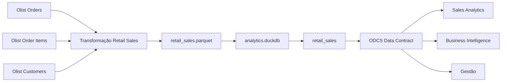

# Data Product de Vendas de Varejo - Olist

Projeto desenvolvido para a disciplina **Data Product Management & Value Delivery**, seguindo a **Trilha 1 - Gestão e Governança**.

A proposta foi construir um Data Product de vendas a partir do **Brazilian E-Commerce Public Dataset by Olist**, aplicando os conceitos trabalhados na disciplina: definição do produto, Data Product Canvas, contrato ODCS, validação automatizada, Data Downtime, Error Budget, catálogo, governança e níveis de serviço.

---

## 1. Autoria

Projeto desenvolvido em coautoria por:

<table>
  <tr>
      <td align="center">
      
      <br/>
      <b>Thatiane Botelho</b>
      <br/>
      <a href="https://github.com/ThatianeBotelho">GitHub</a>
    </td>
    <td align="center">
      
      <br/>
      <b>Tatiane Silva</b>
      <br/>
      <a href="https://github.com/tatiane-ss">GitHub</a>
    </td>    
    <td align="center">
      
      <br/>
      <b>Viviane Corrêa</b>
      <br/>
      <a href="https://github.com/vivianecorrea">GitHub</a>
    </td>
  </tr>
</table>

---

## 2. O que foi desenvolvido

O projeto cria o Data Product:

**Nome de negócio:** Data Product de Vendas de Varejo  
**Nome técnico:** `retail_sales`  
**Domínio:** Varejo / Vendas  
**Versão:** 1.0.0  

O objetivo é disponibilizar uma visão única e governada das vendas, permitindo responder:

- quando a venda ocorreu;
- qual pedido originou a venda;
- qual cliente realizou a compra;
- qual produto foi vendido;
- quantas unidades foram vendidas;
- qual foi o valor dos itens;
- qual é o status do pedido.

O grão definido é:

> **Um Produto dentro de um Pedido.**

Se o mesmo produto aparecer mais de uma vez dentro de um pedido, essas ocorrências são agrupadas em uma única linha.

Exemplo:

```text
Pedido 123 | Produto A | R$ 100
Pedido 123 | Produto A | R$ 100
Pedido 123 | Produto A | R$ 100
```

Resultado:

```text
Pedido 123 | Produto A | Quantidade 3 | Valor R$ 300
```

---

## 3. Cobertura da Trilha 1

| Requisito | Implementação |
|---|---|
| Data Product Canvas | [`docs/canvas_produto_dados.md`](docs/canvas_produto_dados.md) |
| Contrato ODCS | [`datacontract.yaml`](datacontract.yaml) |
| Schema e regras de negócio | definidos no `datacontract.yaml` |
| Validação automatizada | `datacontract-cli` conectado ao DuckDB |
| Evidência da validação | [`evidencias/05_contrato_valido.txt`](evidencias/05_contrato_valido.txt) |
| Simulação de Data Downtime | [`docs/simulacao_incidente.md`](docs/simulacao_incidente.md) |
| Estimativa de impacto financeiro | documentada na simulação de incidente |
| Error Budget | documentado na simulação e no catálogo |
| Catálogo e governança | [`docs/catalogo.md`](docs/catalogo.md) |
| Linhagem | documentada no catálogo |
| SLA / SLO | documentados no catálogo |

Também foi criado um contrato propositalmente incompatível para demonstrar a detecção de breaking changes:

[`datacontract_quebra.yaml`](datacontract_quebra.yaml)

---

## 4. Decisões do Projeto

Durante a definição do produto, algumas escolhas foram feitas para manter o escopo simples e alinhado ao problema de negócio.

### Grão Pedido + Produto

Escolhemos o grão Pedido + Produto porque o mesmo produto pode aparecer mais de uma vez dentro de um pedido.

Essas ocorrências são agrupadas e representadas pela coluna `quantity`.

---

### Uso de três fontes

O dataset Olist possui várias tabelas, mas para este produto utilizamos somente:

- Orders;
- Order Items;
- Customers.

Essas três fontes são suficientes para responder às perguntas de negócio que definimos, sem aumentar o escopo desnecessariamente.

---

### Valor de vendas sem frete

O campo:

```text
sales_amount
```

considera somente:

```text
SUM(item_price)
```

O frete foi excluído porque o objetivo é representar o valor dos produtos vendidos e não o valor total pago pelo cliente.

---

### Identificação do cliente

Utilizamos:

```text
customer_unique_id
```

como `customer_id` no Data Product.

A escolha permite identificar o mesmo cliente em pedidos diferentes utilizando o identificador anonimizado disponível na fonte.

---

### DuckDB

O DuckDB foi escolhido como base analítica por ser simples de executar localmente e permitir a validação do Data Contract diretamente contra uma base de dados.

---

### Escopo da Trilha 1

Como o grupo escolheu a **Trilha 1 - Gestão e Governança**, priorizamos:

- definição do produto;
- semântica;
- contratos;
- qualidade;
- governança;
- níveis de serviço;
- impacto para consumidores.

A implementação de uma pipeline em dbt não faz parte do escopo escolhido.

---

## 5. Schema do Data Product

O `retail_sales` possui oito campos:

| Campo | Tipo | Definição |
|---|---|---|
| `sales_line_id` | String | Identificador técnico único da combinação Pedido + Produto |
| `sale_date` | Date | Data em que o pedido foi realizado |
| `order_id` | String | Identificador do pedido |
| `customer_id` | String | Identificador único e anonimizado do cliente |
| `product_id` | String | Identificador do produto |
| `quantity` | Integer | Quantidade daquele produto no pedido |
| `sales_amount` | Decimal | Soma dos preços dos itens, sem frete |
| `order_status` | String | Status operacional do pedido |

---

## 6. Arquitetura



Fluxo resumido:

```text
Fontes Olist
    ↓
Transformação
    ↓
retail_sales.parquet
    ↓
analytics.duckdb
    ↓
retail_sales
    ↓
Data Contract
    ↓
Consumidores
```

---

## 7. Estrutura do Repositório

```text
FIAP_Data_Product_Management_Vendas_Varejo/
│
├── src/
│   ├── 01_preparar_olist.py
│   ├── 02_configurar_duckdb.py
│   └── 03_consultar_dados.py
│
├── docs/
│   ├── canvas_produto_dados.md
│   ├── catalogo.md
│   └── simulacao_incidente.md
│
├── evidencias/
│   ├── 01_construcao_retail_sales.txt
│   ├── 02_configuracao_duckdb.txt
│   ├── 03_consulta_analitica.txt
│   ├── 04_validacao_sintaxe_contrato.txt
│   ├── 05_contrato_valido.txt
│   └── 06_quebra_esperada.txt
│
├── datacontract.yaml
├── datacontract_quebra.yaml
├── requirements.txt
├── .gitignore
└── README.md
```

A pasta `data/` não é versionada.

Ela é criada durante a execução e contém:

```text
data/
├── raw/
├── retail_sales.parquet
└── analytics.duckdb
```

---

## 8. Pré-requisitos

O projeto foi desenvolvido em **GitHub Codespaces**, mas também pode ser executado em um ambiente Python compatível.

Instale as dependências:

```bash
pip install -r requirements.txt
```

O arquivo `requirements.txt` contém as principais bibliotecas utilizadas:

```text
duckdb
datacontract-cli[duckdb]
pandas
pyarrow
kaggle
```

Para confirmar o ambiente:

```bash
python --version
```

```bash
datacontract --version
```

```bash
python -c "import duckdb; print(duckdb.__version__)"
```

---

## 9. Dados de origem

Utilizamos o **Brazilian E-Commerce Public Dataset by Olist**.

Crie a pasta:

```bash
mkdir -p data/raw
```

O dataset pode ser obtido pela Kaggle CLI:

```bash
kaggle datasets download olistbr/brazilian-ecommerce -p data/raw --unzip
```

Para este projeto são necessários:

```text
data/raw/olist_orders_dataset.csv
data/raw/olist_order_items_dataset.csv
data/raw/olist_customers_dataset.csv
```

Os outros arquivos do dataset podem permanecer na pasta, mas não são utilizados.

---

## 10. Como executar

### 10.1 Construir o Data Product

Execute:

```bash
python src/01_preparar_olist.py
```

Esse script:

- lê as três fontes;
- realiza os joins;
- converte a data do pedido;
- utiliza o identificador único do cliente;
- agrega os registros no grão Pedido + Produto;
- calcula `quantity`;
- calcula `sales_amount`;
- cria `sales_line_id`;
- gera o Parquet final.

Saída:

```text
data/retail_sales.parquet
```

Para salvar a evidência:

```bash
python src/01_preparar_olist.py 2>&1 | tee evidencias/01_construcao_retail_sales.txt
```

---

### 10.2 Criar a base DuckDB

Execute:

```bash
python src/02_configurar_duckdb.py
```

O script carrega:

```text
data/retail_sales.parquet
```

para:

```text
data/analytics.duckdb
```

criando a tabela:

```text
retail_sales
```

Para salvar a evidência:

```bash
python src/02_configurar_duckdb.py 2>&1 | tee evidencias/02_configuracao_duckdb.txt
```

---

### 10.3 Consultar o Data Product

Execute:

```bash
python src/03_consultar_dados.py
```

O script apresenta:

- schema;
- métricas gerais;
- vendas por status;
- produtos com maior valor de vendas;
- amostra dos dados.

Para salvar a evidência:

```bash
python src/03_consultar_dados.py 2>&1 | tee evidencias/03_consulta_analitica.txt
```

---

## 11. Data Product Canvas

O Canvas segue os blocos trabalhados na disciplina:

1. Proposta de Valor e Objetivo de Negócio;
2. Consumidores-Alvo e Casos de Uso;
3. Fontes de Entrada e Fronteira do Domínio;
4. Output Ports;
5. Service Level Objectives;
6. Governança de Dados e Papéis.

Documento:

[`docs/canvas_produto_dados.md`](docs/canvas_produto_dados.md)

---

## 12. Data Contract e Validação

O contrato oficial está em:

[`datacontract.yaml`](datacontract.yaml)

Entre as regras definidas estão:

```text
sales_line_id → obrigatório e único
quantity      → >= 1
sales_amount  → >= 0.01
order_status  → domínio controlado
```

Os demais campos críticos também são obrigatórios.

### Validar a estrutura do contrato

```bash
datacontract lint datacontract.yaml
```

Para registrar a evidência:

```bash
datacontract lint datacontract.yaml 2>&1 | tee evidencias/04_validacao_sintaxe_contrato.txt
```

---

### Validar contra o DuckDB

```bash
datacontract test datacontract.yaml
```

Na execução realizada pelo grupo, o resultado foi:

```text
data contract is valid
Run 28 checks
```

Evidência:

[`evidencias/05_contrato_valido.txt`](evidencias/05_contrato_valido.txt)

---

## 13. Simulação de Breaking Change

Além do contrato oficial, criamos:

[`datacontract_quebra.yaml`](datacontract_quebra.yaml)

Ele possui alterações propositalmente incompatíveis:

```text
sales_amount >= 10000
```

```text
order_status = apenas delivered
```

e uma nova coluna obrigatória inexistente:

```text
sales_channel
```

Execute:

```bash
datacontract test datacontract_quebra.yaml
```

Nesse caso, o resultado esperado é:

```text
FAIL
```

A falha é proposital e demonstra que alterações incompatíveis são identificadas pelo mecanismo de validação.

Evidência:

[`evidencias/06_quebra_esperada.txt`](evidencias/06_quebra_esperada.txt)

---

## 14. Evidências

As principais execuções do projeto foram registradas:

| Etapa | Resultado esperado | Evidência |
|---|---|---|
| Construção do Data Product | PASS | [`01_construcao_retail_sales.txt`](evidencias/01_construcao_retail_sales.txt) |
| Configuração do DuckDB | PASS | [`02_configuracao_duckdb.txt`](evidencias/02_configuracao_duckdb.txt) |
| Consulta Analítica | PASS | [`03_consulta_analitica.txt`](evidencias/03_consulta_analitica.txt) |
| Validação de Sintaxe | PASS | [`04_validacao_sintaxe_contrato.txt`](evidencias/04_validacao_sintaxe_contrato.txt) |
| Data Contract Oficial | PASS - 28 checks | [`05_contrato_valido.txt`](evidencias/05_contrato_valido.txt) |
| Contrato de Quebra | FAIL esperado | [`06_quebra_esperada.txt`](evidencias/06_quebra_esperada.txt) |

Para recriar todas as evidências:

```bash
python src/01_preparar_olist.py 2>&1 | tee evidencias/01_construcao_retail_sales.txt

python src/02_configurar_duckdb.py 2>&1 | tee evidencias/02_configuracao_duckdb.txt

python src/03_consultar_dados.py 2>&1 | tee evidencias/03_consulta_analitica.txt

datacontract lint datacontract.yaml 2>&1 | tee evidencias/04_validacao_sintaxe_contrato.txt

datacontract test datacontract.yaml 2>&1 | tee evidencias/05_contrato_valido.txt

datacontract test datacontract_quebra.yaml 2>&1 | tee evidencias/06_quebra_esperada.txt
```

Estado esperado:

```text
01 - Construção do Data Product   → PASS
02 - Configuração DuckDB          → PASS
03 - Consulta Analítica           → PASS
04 - Validação da Sintaxe         → PASS
05 - Data Contract Oficial        → PASS / 28 checks
06 - Contrato de Quebra           → FAIL esperado
```

---

## 15. Simulação de Incidente

Para explorar o impacto de uma mudança upstream, simulamos a remoção ou alteração de:

```text
product_id
```

Esse campo é essencial para definir o grão do produto.

O cenário considerado foi:

```text
product_id removido
        ↓
transformação falha
        ↓
retail_sales não é atualizado
        ↓
consumidores recebem dados desatualizados
```

Na simulação:

```text
MTTD = 45 minutos

MTTR = 3h15

Data Downtime = 4 horas
```

Também foram utilizadas premissas acadêmicas para estimar o impacto operacional:

```text
12 consumidores
R$ 150/h
4 horas
```

Resultado:

```text
R$ 7.200
```

O valor é apenas uma simulação e não representa informações reais da Olist.

Com SLO de disponibilidade de 99,5%, o Error Budget mensal calculado é:

```text
3,6 horas
```

Como o incidente simulado durou 4 horas:

```text
4h > 3,6h
```

o Error Budget foi excedido em:

```text
24 minutos
```

Detalhes:

[`docs/simulacao_incidente.md`](docs/simulacao_incidente.md)

---

## 16. Catálogo e Governança

A documentação completa do produto está em:

[`docs/catalogo.md`](docs/catalogo.md)

O catálogo reúne:

- propósito;
- grão;
- Input Ports;
- Output Ports;
- dicionário de dados;
- definições de negócio;
- garantias de qualidade;
- consumidores;
- SLIs;
- SLOs;
- SLA;
- Error Budget;
- governança;
- linhagem.

Principais metas simuladas:

| Serviço | Meta |
|---|---:|
| Freshness | ≤ 24 horas |
| Disponibilidade | ≥ 99,5% mensal |
| Qualidade crítica | 100% antes da publicação |
| Comunicação de incidente | ≤ 1 hora após detecção |
| Retenção | ≥ 365 dias |

---

## 17. Limitações e Próximos Passos

A implementação foi construída para fins acadêmicos e possui algumas limitações.

Atualmente:

- a execução é local e manual;
- não existe orquestração automática;
- os SLIs não são monitorados continuamente;
- SLA e impacto financeiro são simulados;
- o catálogo é mantido dentro do próprio repositório;
- a validação do Data Contract não está integrada a uma pipeline de CI/CD.

Como evolução, a solução poderia incorporar:

- automação de execução;
- monitoramento contínuo de SLIs;
- validação contratual em CI/CD;
- alertas de falha;
- catálogo corporativo;
- gestão automatizada de versões do contrato.

---

## 18. Conclusão

O projeto partiu de dados operacionais de e-commerce e construiu um Data Product com uma interface analítica definida e governada.

Mais do que gerar uma nova tabela, procuramos deixar explícitos:

- o problema que o produto resolve;
- quem são seus consumidores;
- qual é o seu grão;
- como suas métricas são calculadas;
- quais regras precisam ser respeitadas;
- quais níveis de serviço são esperados;
- como mudanças incompatíveis podem ser identificadas;
- qual pode ser o impacto de uma falha para o negócio.

O resultado é o `retail_sales`, acompanhado de contrato, documentação, validação e evidências que permitem reproduzir e avaliar a solução.