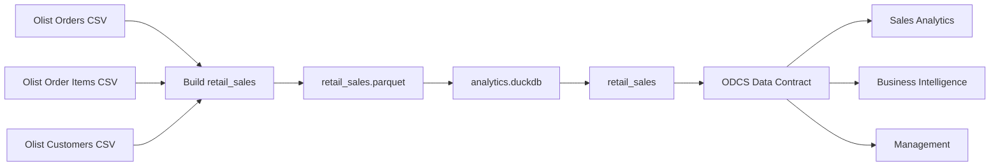

# Retail Sales Data Product - Olist

Projeto da Trilha 1 - Gestão e Governança da disciplina **Data Product Management & Value Delivery**.

A solução transforma dados públicos da Olist em um Data Product de vendas com interface definida, Data Contract, Quality Gates, Data Product Canvas, Data Product Catalog, Data Downtime, Error Budget e consumption Lineage.

---

## Autoria

<table>
  <tr>
    <td align="center">
      
      <br/>
      <b>Thatiane Botelho</b>
      <br/>
      <a href="https://github.com/ThatianeBotelho">GitHub</a>
    </td>
    <td align="center">
      
      <br/>
      <b>Tatiane Silva</b>
      <br/>
      <a href="https://github.com/tatiane-ss">GitHub</a>
    </td>
    <td align="center">
      
      <br/>
      <b>Viviane Corrêa</b>
      <br/>
      <a href="https://github.com/vivianecorrea">GitHub</a>
    </td>
  </tr>
</table>

---

## 1. Visão geral

**Data Product:** Retail Sales  
**Nome técnico:** `retail_sales`  
**Domínio:** Retail / Sales  
**Versão:** 1.0.0  
**Data Product Owner:** Sales Analytics

O objetivo é disponibilizar uma visão única e governada das vendas para Sales Analytics, BI e Gestão, evitando que cada consumidor reconstrua joins, regras de agregação e definições de negócio por conta própria.

O grão é:

> **Um Produto dentro de um Pedido.**

Quando o mesmo produto aparece mais de uma vez no mesmo pedido, as ocorrências são agrupadas em uma única linha e representadas por `quantity`.

O Data Product responde, de forma consistente:

- quando o pedido foi realizado;
- qual pedido originou a linha de venda;
- qual cliente realizou a compra;
- qual produto foi vendido;
- quantas unidades foram vendidas;
- qual o valor dos itens;
- qual o status operacional do pedido.

> `sales_amount` representa o valor dos itens do pedido, sem frete. Não deve ser interpretado automaticamente como receita reconhecida. O campo `order_status` permite que cada análise aplique o filtro adequado ao seu contexto.

---

## 2. Cobertura da Trilha 1

| Requisito | Implementação |
|---|---|
| Data Product Canvas | [`docs/data_product_canvas.md`](docs/data_product_canvas.md) |
| Data Contract ODCS | [`datacontract.yaml`](datacontract.yaml) |
| Output schema e regras de negócio | definidos no Data Contract |
| Quality Gate automatizado | `datacontract-cli` conectado ao DuckDB |
| Evidência do contrato válido | [`evidencias/05_contrato_valido.txt`](evidencias/05_contrato_valido.txt) |
| Breaking Change | [`datacontract_quebra.yaml`](datacontract_quebra.yaml) |
| Evidência do bloqueio esperado | [`evidencias/06_quebra_esperada.txt`](evidencias/06_quebra_esperada.txt) |
| Data Downtime + impacto financeiro | [`docs/data_downtime_incident.md`](docs/data_downtime_incident.md) |
| Error Budget | Data Product Catalog e incident report |
| Data Product Catalog | [`docs/data_product_catalog.md`](docs/data_product_catalog.md) |
| Consumption Lineage | documentado no Data Product Catalog |
| SLIs / SLOs / SLA | documentados no Data Product Catalog |

---

## 3. Decisões do produto

### Grão Order + Product

O dataset de itens pode ter mais de uma ocorrência do mesmo produto dentro do mesmo pedido. Por isso, o produto consolida essas ocorrências no grão **Order + Product**.

A chave técnica é:

```text
sales_line_id = order_id + "-" + product_id
```

### Três Input Ports

A Olist disponibiliza várias tabelas, mas o escopo deste produto utiliza apenas:

- Orders;
- Order Items;
- Customers.

Essas fontes são suficientes para responder às perguntas definidas para o produto sem incluir dados que não fazem parte do objetivo atual.

### Sales Amount sem frete

`sales_amount` é calculado como:

```text
SUM(item_price)
```

O frete foi mantido fora da métrica para separar valor dos itens de custos logísticos.

### Identificação do cliente

O `customer_unique_id` da Olist é exposto no produto como `customer_id`. Isso permite acompanhar o mesmo cliente em pedidos diferentes sem introduzir dados pessoais diretamente identificáveis.

### DuckDB

O DuckDB funciona como Output Port SQL e também como base física usada pelo Quality Gate do Data Contract.

---

## 4. Arquitetura



---

## 5. Estrutura do repositório

```text
FIAP_Data_Product_Management_Vendas_Varejo/
│
├── src/
│   ├── 01_preparar_olist.py
│   ├── 02_configurar_duckdb.py
│   └── 03_consultar_dados.py
│
├── docs/
│   ├── data_product_canvas.md
│   ├── data_product_catalog.md
│   └── data_downtime_incident.md
│
├── evidencias/
│   ├── 01_construcao_retail_sales.txt
│   ├── 02_configuracao_duckdb.txt
│   ├── 03_consulta_analitica.txt
│   ├── 04_validacao_sintaxe_contrato.txt
│   ├── 05_contrato_valido.txt
│   └── 06_quebra_esperada.txt
│
├── datacontract.yaml
├── datacontract_quebra.yaml
├── requirements.txt
├── .gitignore
└── README.md
```

A pasta `data/` não é versionada. Ela é criada durante a execução:

```text
data/
├── raw/
├── retail_sales.parquet
└── analytics.duckdb
```

---

## 6. Pré-requisitos

O projeto foi desenvolvido em GitHub Codespaces, mas pode ser executado em qualquer ambiente Python compatível.

Instalação:

```bash
pip install -r requirements.txt
```

Validação rápida do ambiente:

```bash
python --version
datacontract --version
python -c "import duckdb; print(duckdb.__version__)"
```

---

## 7. Dados de origem

Fonte: **Brazilian E-Commerce Public Dataset by Olist**.

Crie a pasta:

```bash
mkdir -p data/raw
```

Baixe o dataset com a Kaggle CLI:

```bash
kaggle datasets download olistbr/brazilian-ecommerce -p data/raw --unzip
```

Arquivos usados:

```text
data/raw/olist_orders_dataset.csv
data/raw/olist_order_items_dataset.csv
data/raw/olist_customers_dataset.csv
```

---

## 8. Execução

### 8.1 Build do Data Product

```bash
python src/01_preparar_olist.py
```

O script lê os três Input Ports, realiza os joins, agrega no grão Order + Product e gera:

```text
data/retail_sales.parquet
```

Para registrar a execução:

```bash
python src/01_preparar_olist.py 2>&1 | tee evidencias/01_construcao_retail_sales.txt
```

### 8.2 Publicação no DuckDB

```bash
python src/02_configurar_duckdb.py
```

O script cria:

```text
data/analytics.duckdb
└── retail_sales
```

Evidência:

```bash
python src/02_configurar_duckdb.py 2>&1 | tee evidencias/02_configuracao_duckdb.txt
```

### 8.3 Consulta do Output Port SQL

```bash
python src/03_consultar_dados.py
```

O script mostra schema, KPIs, vendas por status, top produtos e uma amostra dos dados.

Evidência:

```bash
python src/03_consultar_dados.py 2>&1 | tee evidencias/03_consulta_analitica.txt
```

---

## 9. Data Product Canvas

O Data Product Canvas está em:

[`docs/data_product_canvas.md`](docs/data_product_canvas.md)

Ele segue os sete blocos usados como referência no projeto:

1. Value Proposition & Business Problem;
2. Consumers & Use Cases;
3. Output Ports;
4. Input Ports & Source Lineage;
5. SLOs & Quality Gates;
6. Governance, Security & Privacy;
7. Success Metrics & Product Value.

---

## 10. Data Contract e Quality Gate

O contrato oficial está em:

[`datacontract.yaml`](datacontract.yaml)

Regras principais:

```text
sales_line_id -> required + unique
quantity      -> minimum 1
sales_amount  -> minimum 0.01
order_status  -> controlled enum
```

Lint:

```bash
datacontract lint datacontract.yaml
```

Evidência:

```bash
datacontract lint datacontract.yaml 2>&1 | tee evidencias/04_validacao_sintaxe_contrato.txt
```

Teste contra o DuckDB:

```bash
datacontract test datacontract.yaml
```

Na execução registrada, o contrato foi aprovado com **28 checks**.

Evidência:

[`evidencias/05_contrato_valido.txt`](evidencias/05_contrato_valido.txt)

---

## 11. Breaking Change

O arquivo:

[`datacontract_quebra.yaml`](datacontract_quebra.yaml)

introduz três mudanças incompatíveis de propósito:

- `sales_amount >= 10000`;
- `order_status` restrito a `delivered`;
- inclusão de `sales_channel` como campo obrigatório inexistente.

Execução:

```bash
datacontract test datacontract_quebra.yaml
```

O resultado esperado é **FAIL**. Nesse caso, a falha representa o comportamento correto do Quality Gate.

Evidência:

[`evidencias/06_quebra_esperada.txt`](evidencias/06_quebra_esperada.txt)

---

## 12. Data Downtime e Error Budget

O incident scenario está documentado em:

[`docs/data_downtime_incident.md`](docs/data_downtime_incident.md)

O cenário considera uma alteração incompatível de `product_id` em um Input Port upstream.

Resumo:

| Indicador | Resultado |
|---|---:|
| MTTD | 45 min |
| MTTR | 3h15 |
| Data Downtime | 4h |
| Consumidores impactados | 12 |
| Custo/hora assumido | R$ 150 |
| Impacto estimado | R$ 7.200 |
| Availability SLO | 99,5% |
| Error Budget mensal | 3,6h |
| Excesso | 24 min |

Os valores de custo são premissas do incident scenario e servem para traduzir a indisponibilidade em impacto operacional.

---

## 13. Data Product Catalog e Lineage

O catálogo está em:

[`docs/data_product_catalog.md`](docs/data_product_catalog.md)

Ele reúne:

- propósito e escopo;
- Grain;
- Input Ports;
- Output Ports;
- Data Dictionary;
- Business Definitions;
- Quality Guarantees;
- Consumers;
- SLIs;
- SLOs;
- SLA;
- Error Budget;
- Ownership e Governance;
- Consumption Lineage;
- Change Management.

Principais metas:

| Service Level | Target |
|---|---:|
| Freshness | <= 24h |
| Availability | >= 99,5% |
| Critical Data Quality | 100% antes da publicação |
| Incident Communication | <= 1h após detecção |
| Retention | >= 365 dias |

---

## 14. Evidências registradas

| Execução | Resultado |
|---|---|
| Build do Data Product | PASS |
| Publicação no DuckDB | PASS |
| Consulta analítica | PASS |
| ODCS lint | PASS |
| Data Contract | PASS / 28 checks |
| Breaking Change | FAIL esperado |

Para recriar as evidências:

```bash
python src/01_preparar_olist.py 2>&1 | tee evidencias/01_construcao_retail_sales.txt
python src/02_configurar_duckdb.py 2>&1 | tee evidencias/02_configuracao_duckdb.txt
python src/03_consultar_dados.py 2>&1 | tee evidencias/03_consulta_analitica.txt
datacontract lint datacontract.yaml 2>&1 | tee evidencias/04_validacao_sintaxe_contrato.txt
datacontract test datacontract.yaml 2>&1 | tee evidencias/05_contrato_valido.txt
datacontract test datacontract_quebra.yaml 2>&1 | tee evidencias/06_quebra_esperada.txt
```

---

## 15. Limitações e próximos passos

A implementação atual mantém o processamento local e intencionalmente simples. Alguns pontos podem evoluir em uma operação de produção:

- scheduling e orchestration;
- monitoramento contínuo dos SLIs;
- execução do Quality Gate em CI/CD;
- alerting;
- integração com um Data Catalog corporativo;
- versionamento e rollout automatizado de contratos.

---

## 16. Resultado

O `retail_sales` deixa de ser apenas uma tabela derivada do dataset Olist e passa a ter uma interface de consumo clara: Grain, schema, Business Definitions, Quality Gates, ownership e Service Levels documentados.

A combinação entre Data Product Canvas, Data Contract, Data Product Catalog, Breaking Change test e incident scenario permite avaliar não apenas se o pipeline roda, mas se o produto continua confiável para quem depende dele.
