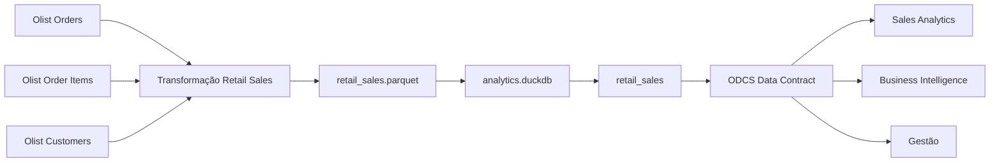

# Catálogo do Data Product

## Data Product de Vendas de Varejo

### Informações do Produto

**Nome de Negócio:** Data Product de Vendas de Varejo  
**Nome Técnico:** `retail_sales`  
**Domínio:** Varejo / Vendas  
**Versão:** 1.0.0  
**Status:** Ativo  
**Data Product Owner:** Time de Sales Analytics  

> **Observação:** este projeto utiliza o Brazilian E-Commerce Public Dataset by Olist para fins acadêmicos. Os níveis de serviço, responsabilidades operacionais e demais cenários de governança definidos neste documento são simulados e não representam compromissos reais da Olist.

---

## 1. Propósito

O Data Product de Vendas de Varejo disponibiliza uma visão analítica padronizada, documentada e governada das vendas.

As informações necessárias para análise comercial estão originalmente distribuídas entre diferentes fontes operacionais, como pedidos, itens dos pedidos e clientes.

Sem uma camada governada, diferentes consumidores podem:

- realizar integrações próprias;
- recriar regras de negócio;
- interpretar métricas de formas distintas;
- produzir valores divergentes para os mesmos indicadores;
- sofrer impactos inesperados quando ocorrerem alterações nas fontes.

O objetivo do `retail_sales` é centralizar essa lógica em um Data Product com definições claras, contrato formal e garantias de qualidade.

O produto permite responder às seguintes perguntas de negócio:

- Quando a venda ocorreu?
- Qual pedido originou a venda?
- Qual cliente realizou a compra?
- Qual produto foi vendido?
- Quantas unidades daquele produto foram vendidas?
- Qual foi o valor da venda?
- Qual é o status operacional do pedido?

---

## 2. Grão

O grão do Data Product é:

> **Um Produto dentro de um Pedido.**

Cada registro de `retail_sales` representa a combinação de um determinado `order_id` com um determinado `product_id`.

Caso o mesmo produto apareça mais de uma vez dentro do mesmo pedido, esses registros são agregados em uma única linha de venda.

### Exemplo

Dados operacionais:

```text
Pedido 123 | Produto A | R$ 100
Pedido 123 | Produto A | R$ 100
Pedido 123 | Produto A | R$ 100
```

Saída do Data Product:

```text
Pedido 123 | Produto A | Quantidade: 3 | Valor de Vendas: R$ 300
```

Essa definição de grão evita duplicidade desnecessária e estabelece uma unidade analítica clara para o consumidor.

---

## 3. Input Ports

O Data Product é construído a partir de três fontes do **Brazilian E-Commerce Public Dataset by Olist**.

### Olist Orders

Arquivo:

```text
olist_orders_dataset.csv
```

Principais informações utilizadas:

- identificador do pedido;
- identificador operacional do cliente;
- data e hora de criação do pedido;
- status do pedido.

### Olist Order Items

Arquivo:

```text
olist_order_items_dataset.csv
```

Principais informações utilizadas:

- identificador do pedido;
- identificador do produto;
- preço do item.

### Olist Customers

Arquivo:

```text
olist_customers_dataset.csv
```

Principais informações utilizadas:

- identificador operacional do cliente;
- identificador único e anonimizado do cliente.

### Relação entre as fontes

A integração ocorre da seguinte forma:

```text
Order Items
    │
    │ order_id
    ▼
Orders
    │
    │ customer_id
    ▼
Customers
```

Essas três fontes são suficientes para construir o Data Product de vendas definido neste projeto.

---

## 4. Output Ports

O Data Product possui duas representações de saída.

### Parquet

Arquivo:

```text
data/retail_sales.parquet
```

O arquivo Parquet representa a saída analítica portável gerada pelo processo de transformação.

Ele pode ser reutilizado por outras ferramentas ou processos analíticos.

### DuckDB

Banco:

```text
data/analytics.duckdb
```

Tabela:

```text
retail_sales
```

A tabela no DuckDB é utilizada para:

- consumo analítico;
- inspeção do schema;
- execução de consultas;
- validação automatizada do Data Contract.

### Contrato

A interface formal do Data Product é definida em:

```text
datacontract.yaml
```

O contrato utiliza o padrão ODCS e descreve o schema esperado, regras de negócio e garantias do produto.

---

## 5. Dicionário de Dados

| Campo | Tipo | Definição |
|---|---|---|
| `sales_line_id` | String | Identificador técnico único da combinação Pedido + Produto |
| `sale_date` | Date | Data em que o pedido foi realizado |
| `order_id` | String | Identificador do pedido associado à venda |
| `customer_id` | String | Identificador único e anonimizado do cliente |
| `product_id` | String | Identificador do produto vendido |
| `quantity` | Integer | Quantidade de unidades do produto dentro do pedido |
| `sales_amount` | Decimal | Soma dos preços dos itens da combinação Pedido + Produto, sem incluir frete |
| `order_status` | String | Status operacional atual do pedido |

---

## 6. Definições de Negócio

### Sales Line

Uma Sales Line representa a venda de um produto específico dentro de um pedido.

O identificador:

```text
sales_line_id
```

é construído a partir da combinação:

```text
order_id + product_id
```

Esse campo é utilizado para garantir unicidade e rastreabilidade técnica.

---

### Data da Venda

O campo:

```text
sale_date
```

é derivado de:

```text
order_purchase_timestamp
```

O timestamp original é convertido para `DATE`.

A granularidade de horário não é necessária para o caso de uso proposto, pois o Data Product foi desenhado para análise diária de vendas.

---

### Pedido

O campo:

```text
order_id
```

representa o pedido associado à linha de venda.

Ele permite rastrear cada registro analítico até a transação operacional que o originou.

---

### Cliente

O campo:

```text
customer_id
```

é derivado do:

```text
customer_unique_id
```

da fonte Olist.

Esse identificador foi escolhido porque permite reconhecer o mesmo cliente de maneira consistente em pedidos diferentes.

Os dados utilizados são anonimizados.

---

### Produto

O campo:

```text
product_id
```

identifica o produto vendido.

Ele permite análises posteriores por produto e pode ser utilizado como chave para integração com informações adicionais de produto.

---

### Quantidade

O campo:

```text
quantity
```

representa a quantidade de ocorrências do mesmo produto dentro do mesmo pedido.

A regra de cálculo é:

```text
COUNT(*)
```

para cada combinação de:

```text
order_id + product_id
```

Exemplo:

```text
Pedido A | Produto X
Pedido A | Produto X
Pedido A | Produto X
```

resulta em:

```text
quantity = 3
```

---

### Valor de Vendas

O campo:

```text
sales_amount
```

representa o valor monetário dos produtos vendidos na linha.

A regra de cálculo é:

```text
SUM(item_price)
```

para cada combinação Pedido + Produto.

O valor de frete não é incluído.

Portanto:

```text
sales_amount ≠ valor total pago pelo cliente
```

O indicador representa exclusivamente o valor dos itens utilizados na construção da linha de venda.

---

### Status do Pedido

O campo:

```text
order_status
```

representa o status operacional do pedido associado à venda.

Os valores aceitos pelo Data Contract são:

- `approved`
- `canceled`
- `created`
- `delivered`
- `invoiced`
- `processing`
- `shipped`
- `unavailable`

O status permite que os consumidores diferenciem, por exemplo, pedidos entregues de pedidos cancelados ou ainda em processamento.

---

## 7. Garantias de Qualidade

As principais garantias de qualidade são formalizadas no arquivo:

```text
datacontract.yaml
```

### Unicidade

O campo:

```text
sales_line_id
```

deve ser único.

Não são permitidas duas linhas representando a mesma combinação de Pedido + Produto.

---

### Completude

Os seguintes campos são obrigatórios:

- `sales_line_id`
- `sale_date`
- `order_id`
- `customer_id`
- `product_id`
- `quantity`
- `sales_amount`
- `order_status`

O Data Product não deve ser considerado válido caso qualquer uma dessas informações críticas esteja ausente.

---

### Quantidade

A regra mínima para `quantity` é:

```text
quantity >= 1
```

Uma linha de venda não pode existir sem ao menos uma unidade do produto.

---

### Valor de Vendas

A regra mínima para `sales_amount` é:

```text
sales_amount >= 0.01
```

Não são aceitas linhas com valor nulo, zero ou negativo.

---

### Status

O campo `order_status` deve pertencer ao domínio formal definido pelo Data Contract.

Valores fora da lista aceita representam quebra de contrato.

---

### Quality Gate

O Data Product deve alcançar:

> **100% de conformidade nas regras críticas do Data Contract antes da publicação.**

Caso uma regra crítica falhe, a versão não deve ser considerada pronta para consumo.

---

## 8. Consumidores

### Sales Analytics

Principais casos de uso:

- análise do volume vendido;
- análise do valor de vendas;
- tendências de vendas ao longo do tempo;
- análise de atividade de clientes;
- análise de performance de produtos;
- análise por status do pedido.

---

### Business Intelligence

Principais casos de uso:

- construção de dashboards;
- construção de relatórios;
- criação de modelos semânticos;
- consumo de métricas de vendas padronizadas.

---

### Gestão

Principais casos de uso:

- acompanhamento de indicadores comerciais;
- monitoramento de tendências;
- acompanhamento de volume e valor das vendas;
- suporte à tomada de decisão.

---

## 9. SLIs

SLI — **Service Level Indicator** — representa uma medida objetiva utilizada para acompanhar a saúde do Data Product.

### Freshness SLI

Mede o tempo transcorrido entre a disponibilidade dos dados nas fontes e a publicação da versão atualizada do Data Product.

Exemplo:

```text
Data disponível na origem: 08:00
Data Product publicado:     10:00

Freshness = 2 horas
```

---

### Availability SLI

Mede o percentual de tempo em que o Data Product permanece disponível e válido para consumo analítico.

Conceitualmente:

```text
Availability =
Tempo Disponível / Tempo Total Esperado
```

---

### Data Quality SLI

Mede o percentual de regras críticas do Data Contract atendidas pela versão publicada.

Conceitualmente:

```text
Data Quality =
Checks Críticos Aprovados / Total de Checks Críticos
```

---

### Incident Communication SLI

Mede o intervalo entre:

```text
detecção de um incidente crítico
```

e:

```text
comunicação aos consumidores afetados
```

---

## 10. SLOs

SLO — **Service Level Objective** — representa a meta operacional definida para cada indicador.

### Freshness SLO

Meta:

> **≤ 24 horas**

O Data Product deve ser atualizado em até 24 horas após a disponibilidade dos dados de origem, no cenário operacional simulado.

---

### Availability SLO

Meta mensal:

> **≥ 99,5%**

---

### Data Quality SLO

Meta:

> **100% de conformidade das regras críticas antes da publicação**

Uma versão com falha em regra crítica não deve ser publicada para os consumidores.

---

### Incident Communication SLO

Meta:

> **≤ 1 hora após a detecção de um incidente crítico**

---

### Retenção

Meta:

> **≥ 365 dias**

O histórico analítico deve permanecer disponível por pelo menos 365 dias.

---

## 11. SLA

SLA — **Service Level Agreement** — representa o compromisso formal estabelecido entre o time responsável pelo Data Product e seus consumidores.

Os compromissos abaixo fazem parte de um cenário operacional simulado para fins acadêmicos.

| Serviço | SLO | Compromisso de SLA |
|---|---|---|
| Freshness | ≤ 24 horas | Os dados devem ser disponibilizados em até 24 horas após a disponibilidade das fontes |
| Disponibilidade | ≥ 99,5% mensal | A disponibilidade mensal do Data Product deve permanecer igual ou superior a 99,5% |
| Qualidade | 100% de conformidade crítica | O Data Product não deve ser publicado quando checks críticos do contrato falharem |
| Comunicação de Incidente | ≤ 1 hora após detecção | Consumidores afetados devem ser comunicados em até uma hora após a identificação de um incidente crítico |
| Retenção | ≥ 365 dias | O histórico analítico deve permanecer disponível por pelo menos 365 dias |

### Resposta à Violação do SLA

Caso um SLA crítico seja violado:

1. o incidente deve ser formalmente registrado;
2. os consumidores afetados devem ser comunicados;
3. a publicação deve ser bloqueada caso regras críticas do Data Contract falhem;
4. a restauração do serviço passa a ser prioridade do time do Data Product;
5. uma análise de causa raiz deve ser realizada;
6. o consumo do Error Budget deve ser atualizado;
7. ações preventivas devem ser documentadas;
8. mudanças não críticas podem ser postergadas até a restauração da confiabilidade.

---

## 12. Error Budget

O Error Budget representa a quantidade de indisponibilidade tolerada sem violar o SLO de disponibilidade.

O SLO definido é:

```text
99,5%
```

Portanto:

```text
Error Budget = 100% - 99,5%
```

Resultado:

```text
Error Budget = 0,5%
```

Considerando uma janela mensal de 30 dias:

```text
30 × 24 horas = 720 horas
```

A indisponibilidade máxima tolerada é:

```text
720 × 0,5%
```

Resultado:

```text
3,6 horas
```

Portanto:

> **Error Budget mensal = 3,6 horas**

No incidente simulado neste projeto, o Data Downtime é de:

```text
4 horas
```

Comparação:

```text
4,0 horas > 3,6 horas
```

Resultado:

> **Error Budget excedido**

Excesso:

```text
4,0 - 3,6 = 0,4 horas
```

ou:

```text
24 minutos
```

A simulação completa está disponível em:

[`simulacao_incidente.md`](simulacao_incidente.md)

---

## 13. Governança

### Ownership

O Data Product possui como owner simulado:

> **Time de Sales Analytics**

O time é responsável por:

- definições de negócio;
- manutenção do Data Contract;
- definição das regras de qualidade;
- manutenção da documentação;
- monitoramento dos níveis de serviço;
- gestão de versões;
- comunicação com consumidores;
- tratamento de incidentes.

---

### Contrato

O contrato formal e machine-readable está disponível em:

```text
datacontract.yaml
```

Ele representa a interface formal entre o produto e seus consumidores.

---

### Versionamento

Versão atual:

```text
1.0.0
```

O produto segue uma estratégia baseada em versionamento semântico.

Uma alteração compatível pode resultar, por exemplo, em:

```text
1.0.0 → 1.1.0
```

Uma alteração incompatível, ou **breaking change**, deve gerar uma nova versão major:

```text
1.0.0 → 2.0.0
```

Exemplos de breaking changes:

- remoção de um campo obrigatório;
- alteração incompatível de tipo;
- alteração do significado de uma métrica;
- introdução de uma regra obrigatória incompatível;
- redução do domínio permitido de forma incompatível com dados existentes.

---

### Gestão de Breaking Changes

Antes de uma nova versão ser considerada pronta para consumo:

1. o novo contrato deve ser validado;
2. os impactos downstream devem ser avaliados;
3. consumidores devem ser comunicados quando necessário;
4. incompatibilidades críticas devem bloquear a publicação.

O projeto inclui o arquivo:

```text
datacontract_quebra.yaml
```

para demonstrar esse comportamento de maneira controlada.

---

## 14. Linhagem

A linhagem representa o fluxo completo entre as fontes operacionais, a transformação, o Data Product e seus consumidores.



---

## 15. Interpretação da Linhagem

A linhagem permite visualizar o caminho completo do dado.

### Upstream

As fontes de origem são:

```text
Olist Orders
Olist Order Items
Olist Customers
```

Elas representam os dados operacionais utilizados para a construção do produto.

---

### Transformação

As três fontes são processadas pela:

```text
Transformação Retail Sales
```

Nessa etapa são realizadas operações como:

- integração entre pedidos, itens e clientes;
- conversão do timestamp para data;
- definição do identificador analítico de cliente;
- agregação no grão Pedido + Produto;
- cálculo da quantidade;
- cálculo do valor de vendas;
- criação da chave `sales_line_id`.

---

### Output Analítico

O resultado é persistido inicialmente em:

```text
retail_sales.parquet
```

Esse arquivo representa a saída analítica portável do produto.

---

### Camada de Consumo e Validação

O arquivo Parquet é carregado no banco:

```text
analytics.duckdb
```

na tabela:

```text
retail_sales
```

Essa implementação é então comparada com as garantias formalizadas no:

```text
ODCS Data Contract
```

O contrato valida schema, tipos, obrigatoriedade, unicidade e regras de negócio antes que a versão seja considerada válida para consumo.

---

### Downstream

Os principais consumidores simulados são:

- Sales Analytics;
- Business Intelligence;
- Gestão.

A linhagem permite identificar quais consumidores podem ser afetados por mudanças upstream.

Por exemplo:

```text
product_id removido da fonte
        ↓
transformação falha
        ↓
retail_sales não é publicado
        ↓
contrato não pode ser atendido
        ↓
Sales Analytics, BI e Gestão são impactados
```

Esse rastreamento facilita:

- análise de impacto;
- investigação de causa raiz;
- comunicação com consumidores;
- gestão de mudanças;
- governança do Data Product.

---

## Resumo do Catálogo

| Item | Definição |
|---|---|
| Data Product | `retail_sales` |
| Domínio | Varejo / Vendas |
| Grão | Produto dentro de um Pedido |
| Owner | Time de Sales Analytics |
| Input Ports | Orders, Order Items, Customers |
| Output Principal | `retail_sales.parquet` |
| Banco Analítico | `analytics.duckdb` |
| Tabela | `retail_sales` |
| Data Contract | `datacontract.yaml` |
| Freshness SLO | ≤ 24 horas |
| Availability SLO | ≥ 99,5% mensal |
| Data Quality SLO | 100% de checks críticos |
| Incident Communication SLO | ≤ 1 hora |
| Retenção | ≥ 365 dias |
| Error Budget mensal | 3,6 horas |