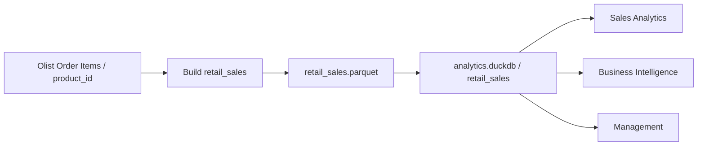

# Data Downtime Incident - Retail Sales

## Incident Summary

| Attribute | Value |
|---|---|
| Data Product | `retail_sales` |
| Severity | High |
| Status | Resolved |
| Critical dependency | `product_id` |
| Detection | 08:45 |
| Recovery | 12:00 |
| MTTD | 45 min |
| MTTR | 3h15 |
| Data Downtime | 4h |
| Availability SLO | 99,5% |
| Monthly Error Budget | 3,6h |
| Budget status | Exceeded by 24 min |

---

## 1. Scenario

Uma mudança upstream remove ou renomeia `product_id` no Input Port de Order Items.

Esse campo é crítico porque participa de:

- Grain Order + Product;
- `sales_line_id`;
- agregação de `quantity`;
- análise de produto;
- consumption Lineage.

Sem `product_id`, o build não consegue produzir uma nova versão válida de `retail_sales`.

---

## 2. Technical Impact

```text
product_id removed / renamed
        ↓
retail_sales build fails
        ↓
new Parquet is not published
        ↓
DuckDB keeps the last valid version
        ↓
Freshness SLO is violated
        ↓
consumers operate with stale data
```

A última versão válida pode continuar disponível, mas deixa de cumprir Freshness. O incidente é tratado como Data Downtime porque o produto não consegue entregar informação atualizada dentro do Service Level acordado.

---

## 3. Impacted Consumers

### Sales Analytics

- análises de produto ficam desatualizadas;
- indicadores do dia não refletem os pedidos mais recentes.

### Business Intelligence

- dashboards continuam disponíveis, mas com dado stale;
- refresh deixa de representar a operação corrente.

### Management

- decisões passam a utilizar uma fotografia antiga do negócio.

---

## 4. Timeline

| Time | Event |
|---|---|
| 08:00 | publicação esperada não ocorre |
| 08:45 | atraso detectado e incidente aberto |
| 09:00 | investigação iniciada |
| 10:00 | Breaking Change em `product_id` identificado |
| 11:30 | transformação ajustada para a nova interface |
| 11:45 | Data Contract e Quality Gates reexecutados |
| 12:00 | produto republicado e consumidores comunicados |

---

## 5. MTTD

O incidente começa às 08:00 e é detectado às 08:45.

```text
MTTD = 45 minutos
```

---

## 6. MTTR

A recuperação começa após a detecção, às 08:45, e termina às 12:00.

```text
MTTR = 3h15
```

---

## 7. Data Downtime

```text
Data Downtime = MTTD + MTTR
Data Downtime = 45 min + 3h15
Data Downtime = 4 horas
```

---

## 8. Financial Impact

Para traduzir o incidente em impacto operacional, o cenário usa as seguintes premissas:

```text
12 consumidores impactados
R$ 150 por hora por consumidor
4 horas de Data Downtime
```

Cálculo:

```text
12 x R$ 150 x 4 = R$ 7.200
```

> **Impacto estimado: R$ 7.200**

Esse valor representa custo de produtividade no cenário definido. Não inclui impacto indireto em decisões, retrabalho posterior ou oportunidade perdida.

---

## 9. Error Budget

Availability SLO:

```text
99,5%
```

Budget disponível:

```text
100% - 99,5% = 0,5%
```

Em uma janela de 30 dias:

```text
30 x 24 = 720 horas
720 x 0,5% = 3,6 horas
```

O incidente consumiu:

```text
4 horas
```

Logo:

```text
4,0h - 3,6h = 0,4h = 24 minutos
```

> **O Error Budget mensal foi excedido em 24 minutos.**

---

## 10. Governance Response

Com o Error Budget excedido, a prioridade muda temporariamente de evolução funcional para confiabilidade.

Ações esperadas:

1. interromper mudanças não críticas no Data Product;
2. concluir root cause analysis;
3. revisar dependências upstream;
4. reforçar Quality Gates;
5. acompanhar Freshness e Availability com maior frequência;
6. comunicar status e recovery aos consumidores;
7. definir ações preventivas antes de retomar mudanças de maior risco.

---

## 11. Data Contract and Quality Gate

O Data Contract exige `product_id` como campo obrigatório.

Contrato oficial:

```bash
datacontract test datacontract.yaml
```

Uma versão saudável deve retornar PASS.

O repositório também contém um Breaking Change test:

```bash
datacontract test datacontract_quebra.yaml
```

Nesse caso, o FAIL é esperado e demonstra o bloqueio de uma interface incompatível.

O mesmo princípio se aplica ao incidente de `product_id`: se a interface física deixa de atender o contrato, a versão não deve ser publicada como saudável.

---

## 12. Incident Flow

```mermaid
flowchart LR
    A[Upstream Change] --> B[product_id removed or renamed]
    B --> C[retail_sales build fails]
    C --> D[No new valid publication]
    D --> E[Freshness violation]
    E --> F[Incident detected]
    F --> G[Root cause analysis]
    G --> H[Transformation fixed]
    H --> I[Quality Gate PASS]
    I --> J[Data Product republished]
    J --> K[Consumers notified]
```



---

## 13. Lineage and Blast Radius



A alteração de `product_id` afeta o produto inteiro porque o campo participa do Grain e da chave técnica.

Blast Radius direto:

- build de `retail_sales`;
- Parquet;
- tabela DuckDB;
- consumidores analíticos.

---

## 14. Preventive Actions

### Upstream Change Management

Campos críticos devem ter comunicação prévia antes de rename, remoção ou mudança de tipo.

Dependências críticas atuais:

```text
order_id
product_id
customer_id
order_purchase_timestamp
order_status
price
```

### Contract Testing

Executar o Data Contract antes de considerar uma nova versão pronta para consumo.

### Freshness Monitoring

Criar alerta quando a publicação esperada não ocorrer dentro da janela de 24 horas.

### Error Budget Review

Todo incidente com impacto de Availability ou Freshness deve ser registrado e consumir o budget correspondente.

### Root Cause Follow-up

Incidentes High devem registrar:

- causa raiz;
- impacto;
- MTTD;
- MTTR;
- Data Downtime;
- consumidores afetados;
- corrective actions;
- preventive actions.

---

## 15. Final Assessment

O incidente mostra que um Breaking Change aparentemente pequeno em um Input Port pode interromper a atualização de todo o Data Product.

A combinação entre Data Contract, Quality Gates, Service Levels, Error Budget e Lineage permite responder a três perguntas importantes:

1. **o que quebrou?**
2. **quem foi impactado?**
3. **quanto tempo e capacidade de confiabilidade foram consumidos?**

Nesse cenário, a recuperação ocorre em quatro horas, mas o tempo é suficiente para exceder o Error Budget mensal. O resultado orienta uma ação clara: estabilizar o produto antes de introduzir novas mudanças de risco.
