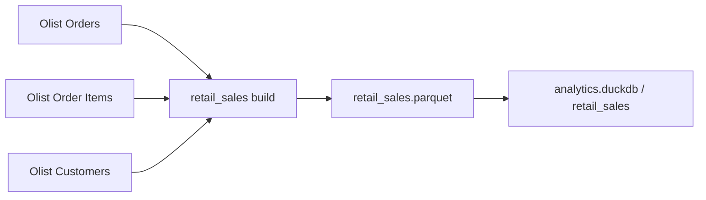

# Data Product Canvas - Retail Sales

**Data Product:** Retail Sales  
**Technical name:** `retail_sales`  
**Domain:** Retail / Sales  
**Version:** 1.0.0  
**Lifecycle status:** Active  
**Data Product Owner:** Sales Analytics

---

## 1. Value Proposition & Business Problem

### Business Problem

Os dados necessários para análise de vendas estão distribuídos entre pedidos, itens e clientes. Quando cada consumidor precisa reconstruir essa integração, regras simples acabam sendo implementadas de maneiras diferentes e os números deixam de ser comparáveis.

O problema principal não é falta de dado, e sim falta de uma interface analítica estável e compartilhada.

### Value Proposition

O `retail_sales` entrega uma visão padronizada de vendas no grão **Order + Product**, com schema explícito, Business Definitions e Quality Gates.

O produto permite responder de forma consistente:

- quando o pedido foi realizado;
- qual pedido originou a linha;
- qual cliente realizou a compra;
- qual produto foi vendido;
- quantas unidades foram vendidas;
- qual o valor dos itens;
- qual o status do pedido.

### Grain

> **Uma linha por Produto dentro de um Pedido.**

A combinação `order_id + product_id` identifica a linha lógica do produto. Quando o mesmo produto aparece mais de uma vez no mesmo pedido, as ocorrências são agregadas e representadas por `quantity`.

---

## 2. Consumers & Use Cases

### Sales Analytics

Principais usos:

- análise de volume e valor de vendas;
- evolução ao longo do tempo;
- comportamento de clientes;
- performance de produtos;
- análise por `order_status`.

### Business Intelligence

Principais usos:

- dashboards;
- relatórios gerenciais;
- semantic models;
- métricas compartilhadas.

### Management

Principais usos:

- acompanhamento de indicadores comerciais;
- leitura de tendências;
- priorização de análises;
- suporte à tomada de decisão.

---

## 3. Output Ports

### Parquet

```text
data/retail_sales.parquet
```

Uso principal:

- consumo por ferramentas analíticas;
- troca entre processos;
- persistência columnar portátil.

### DuckDB

```text
data/analytics.duckdb
└── retail_sales
```

Uso principal:

- SQL analytics;
- inspeção de schema;
- Data Contract testing.

### Semantic Contract

```text
datacontract.yaml
```

O Data Contract é a referência formal para schema, required fields, uniqueness, allowed values e regras numéricas.

---

## 4. Input Ports & Source Lineage

O produto usa três arquivos do Brazilian E-Commerce Public Dataset by Olist.

### Orders

```text
olist_orders_dataset.csv
```

Campos usados:

- `order_id`;
- `customer_id`;
- `order_purchase_timestamp`;
- `order_status`.

### Order Items

```text
olist_order_items_dataset.csv
```

Campos usados:

- `order_id`;
- `product_id`;
- `price`.

### Customers

```text
olist_customers_dataset.csv
```

Campos usados:

- `customer_id`;
- `customer_unique_id`.

### Source Lineage



### Domain Boundary

Incluído no escopo:

- pedidos;
- produtos;
- clientes anonimizados;
- quantidade;
- valor dos itens;
- status do pedido.

Fora do escopo atual:

- pagamentos;
- reviews;
- sellers;
- geolocation;
- freight como componente da métrica;
- margem;
- reconhecimento contábil de receita.

---

## 5. SLOs & Quality Gates

### Service Level Objectives

| SLO | Target |
|---|---:|
| Freshness | <= 24h |
| Availability | >= 99,5% mensal |
| Critical Data Quality | 100% antes da publicação |
| Incident Communication | <= 1h após detecção |
| Retention | >= 365 dias |

### Critical Quality Gates

- `sales_line_id` deve ser obrigatório e único;
- `sale_date`, `order_id`, `customer_id`, `product_id` e `order_status` são obrigatórios;
- `quantity >= 1`;
- `sales_amount >= 0.01`;
- `order_status` deve pertencer ao domínio definido no Data Contract.

Uma versão que falha em uma regra crítica não deve ser considerada pronta para consumo.

---

## 6. Governance, Security & Privacy

### Ownership

**Data Product Owner:** Sales Analytics

Responsabilidades:

- manter Business Definitions;
- aprovar mudanças de contrato;
- acompanhar Service Levels;
- coordenar comunicação com consumidores;
- priorizar correções de confiabilidade.

### Privacy

O produto usa `customer_unique_id` como identificador analítico de cliente e não expõe nome, e-mail, documento ou dados de cartão.

### Change Management

Mudanças backward compatible podem evoluir a versão minor.

Exemplo:

```text
1.0.0 -> 1.1.0
```

Breaking Changes devem evoluir a versão major.

Exemplo:

```text
1.0.0 -> 2.0.0
```

São exemplos de Breaking Change:

- remoção de campo obrigatório;
- mudança incompatível de tipo;
- mudança de significado de uma métrica;
- novo campo obrigatório sem compatibilidade;
- restrição incompatível do domínio permitido.

---

## 7. Success Metrics & Product Value

O produto é considerado saudável quando:

- 100% dos Quality Gates críticos passam antes da publicação;
- `sales_line_id` permanece sem duplicidade;
- Freshness permanece dentro de 24 horas;
- Availability mensal permanece em pelo menos 99,5%;
- Breaking Changes são detectados antes de chegar aos consumidores;
- consumidores utilizam as Business Definitions do produto em vez de recriar regras paralelas.

O valor esperado está principalmente em três pontos:

1. **consistência:** mesma definição de venda para diferentes consumidores;
2. **reuso:** joins e regras deixam de ser reconstruídos a cada análise;
3. **confiabilidade:** mudanças incompatíveis passam por Quality Gate antes da publicação.

O impacto financeiro de falhas é tratado no incident scenario documentado em [`data_downtime_incident.md`](data_downtime_incident.md).
