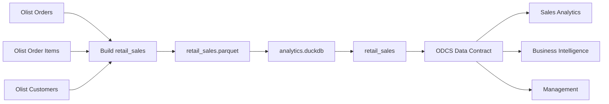

# Data Product Catalog - Retail Sales

## Product Overview

| Attribute | Value |
|---|---|
| Data Product | Retail Sales |
| Technical name | `retail_sales` |
| Domain | Retail / Sales |
| Version | 1.0.0 |
| Lifecycle status | Active |
| Data Product Owner | Sales Analytics |
| Data Contract | `datacontract.yaml` |

---

## 1. Purpose

O `retail_sales` fornece uma interface analítica única para vendas da Olist, reduzindo a duplicação de joins e regras de negócio entre consumidores.

A proposta não é reproduzir todo o modelo operacional da Olist. O produto entrega apenas os atributos necessários para análise de venda no Grain definido.

---

## 2. Grain

> **Uma linha por Produto dentro de um Pedido.**

Chave técnica:

```text
sales_line_id = order_id + "-" + product_id
```

Se o mesmo produto aparecer várias vezes no mesmo pedido, as ocorrências são agregadas.

---

## 3. Input Ports

### Olist Orders

```text
data/raw/olist_orders_dataset.csv
```

Fornece:

- `order_id`;
- `customer_id`;
- `order_purchase_timestamp`;
- `order_status`.

### Olist Order Items

```text
data/raw/olist_order_items_dataset.csv
```

Fornece:

- `order_id`;
- `product_id`;
- `price`.

### Olist Customers

```text
data/raw/olist_customers_dataset.csv
```

Fornece:

- `customer_id`;
- `customer_unique_id`.

---

## 4. Output Ports

### Parquet

```text
data/retail_sales.parquet
```

Formato columnar para consumo e interoperabilidade.

### DuckDB

```text
data/analytics.duckdb
└── retail_sales
```

Interface SQL para análise e Data Contract testing.

### Data Contract

```text
datacontract.yaml
```

Interface formal do produto.

---

## 5. Data Dictionary

| Field | Type | Required | Definition |
|---|---|---:|---|
| `sales_line_id` | String | Sim | Chave técnica única de Order + Product |
| `sale_date` | Date | Sim | Data em que o pedido foi realizado |
| `order_id` | String | Sim | Identificador do pedido |
| `customer_id` | String | Sim | Identificador único e anonimizado do cliente |
| `product_id` | String | Sim | Identificador do produto |
| `quantity` | Integer | Sim | Quantidade do produto no pedido |
| `sales_amount` | Decimal | Sim | Soma de `item_price`, sem frete |
| `order_status` | String | Sim | Status operacional do pedido |

---

## 6. Business Definitions

### Sale Date

`sale_date` é derivado de `order_purchase_timestamp` e representa a data em que o pedido foi realizado.

### Customer

`customer_id` no Data Product é derivado de `customer_unique_id`, permitindo reconhecer o mesmo cliente em pedidos distintos.

### Quantity

`quantity` é a contagem de ocorrências do mesmo `product_id` dentro do mesmo `order_id`.

### Sales Amount

```text
sales_amount = SUM(item_price)
```

Freight não faz parte da métrica.

`sales_amount` representa valor dos itens do pedido. Não é, por si só, uma definição de receita reconhecida. Para análises de pedidos concluídos, o consumidor deve aplicar a regra apropriada sobre `order_status`.

### Order Status

Valores aceitos pelo Data Contract:

```text
approved
canceled
created
delivered
invoiced
processing
shipped
unavailable
```

---

## 7. Quality Guarantees

Antes da publicação, o produto deve respeitar:

- `sales_line_id` required e unique;
- campos críticos sem null;
- `quantity >= 1`;
- `sales_amount >= 0.01`;
- `order_status` dentro do domínio esperado.

O Quality Gate é executado com:

```bash
datacontract test datacontract.yaml
```

Uma falha crítica bloqueia a versão até correção ou revisão formal do contrato.

---

## 8. Consumers

### Sales Analytics

Usa o produto para análises de vendas, clientes, produtos e status.

### Business Intelligence

Usa o Output Port SQL para dashboards, relatórios e semantic models.

### Management

Consome indicadores consolidados derivados do produto para acompanhamento comercial.

---

## 9. SLIs

| SLI | Measurement |
|---|---|
| Freshness | tempo entre disponibilidade upstream e publicação do produto |
| Availability | percentual da janela em que o produto está disponível e válido |
| Data Quality | percentual de Quality Gates críticos aprovados |
| Incident Communication | tempo entre detecção e comunicação aos consumidores |

---

## 10. SLOs

| SLO | Target |
|---|---:|
| Freshness | <= 24h |
| Availability | >= 99,5% mensal |
| Critical Data Quality | 100% antes da publicação |
| Incident Communication | <= 1h após detecção |
| Retention | >= 365 dias |

---

## 11. SLA

O SLA operacional do produto assume:

- publicação dentro da janela de Freshness;
- Availability mensal mínima de 99,5%;
- nenhuma versão publicada com Quality Gate crítico em FAIL;
- comunicação de incidente crítico em até 1 hora após detecção.

Quando um SLO é violado, o Data Product Owner coordena comunicação, recuperação e follow-up com os consumidores.

---

## 12. Error Budget

Com Availability SLO de 99,5%:

```text
Error Budget = 100% - 99,5% = 0,5%
```

Para uma janela de 30 dias:

```text
30 x 24 = 720 horas
720 x 0,5% = 3,6 horas
```

Portanto:

> **Error Budget mensal: 3,6 horas**

O incident scenario atual consome 4 horas e, por isso, excede o budget em 24 minutos.

---

## 13. Ownership & Governance

### Data Product Owner

**Sales Analytics**

Responsável por:

- Business Definitions;
- priorização do roadmap;
- aprovação de mudanças;
- comunicação com consumidores;
- acompanhamento dos Service Levels.

### Engineering

Responsável por:

- build do Parquet;
- publicação no DuckDB;
- execução dos Quality Gates;
- correção de falhas técnicas;
- manutenção dos scripts.

### Consumers

Responsáveis por:

- usar o Grain e Business Definitions documentados;
- comunicar novos requisitos;
- evitar redefinições locais sem alinhamento.

---

## 14. Consumption Lineage



### Reading the Lineage

**Upstream**

- Olist Orders;
- Olist Order Items;
- Olist Customers.

**Transformation**

- `src/01_preparar_olist.py`.

**Storage / Serving**

- `retail_sales.parquet`;
- `analytics.duckdb`;
- `retail_sales`.

**Contract**

- `datacontract.yaml`.

**Downstream**

- Sales Analytics;
- Business Intelligence;
- Management.

O campo `product_id` é uma dependência crítica porque participa do Grain, da chave técnica, da agregação e de análises downstream.

---

## 15. Change Management

### Backward-compatible changes

Exemplos:

- novo campo opcional;
- nova descrição;
- nova documentação;
- melhoria sem alteração de semântica existente.

Essas mudanças podem evoluir uma versão minor.

### Breaking Changes

Exemplos:

- remoção ou rename de campo obrigatório;
- mudança incompatível de tipo;
- mudança de Grain;
- alteração de significado de `sales_amount`;
- novo campo required sem compatibilidade;
- restrição incompatível de enum.

Breaking Changes exigem:

1. nova versão major;
2. análise de impacto downstream;
3. comunicação aos consumidores;
4. revalidação do Data Contract;
5. plano de migração quando necessário.

O arquivo `datacontract_quebra.yaml` mantém um cenário deliberadamente incompatível para demonstrar o comportamento do Quality Gate.

---

## 16. Operational Notes

A publicação atual é executada localmente. O desenho permite evolução para scheduling, CI/CD e monitoramento contínuo sem alterar a interface do produto.

A fonte de verdade para a interface continua sendo o Data Contract, enquanto este catálogo concentra contexto de negócio, ownership, Service Levels e Lineage.
